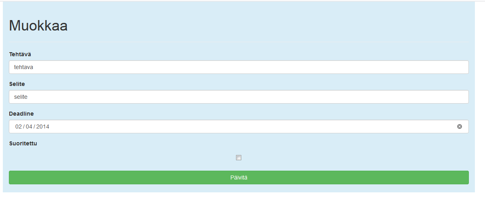

# To-do Software

Small demonstration project of the To-Do list.
`.war` runnable by Tomcat.

## How to run

> Since build tool is not currently present, we are doing this manually. This is legacy stuff and recommended **only** for small projects!

> Requirements for running locally
> 1. Apache Software Foundation Tomcat. Tested with [Tomcat 9.0](https://tomcat.apache.org/download-90.cgi)

1. Pull repository
2. Go to project folder `JspMysqlBootstrapTODO`
3. Create `classes` folder. With tool of your choice 
`mkdir ./WebContent/WEB-INF/classes`
4. Compile needed `java` code 
`javac -d WebContent/WEB-INF/classes src/com/dbconnectiontools/*.java` 
5. Got to `WebContent` folder and build `.war` file for Tomcat server.
`jar -cvf JspMysqlBootstrapTODO.war *`
6. Deploy your new WAR file by copying it to `<tomcat-install-directory>\webapps`. In my case it was, 
`C:\Program Files\Apache Software Foundation\Tomcat 9.0\webapps`
Tomcat should be running at this moment!
Give it some time to make the deployment. You will see new folder appearing into **webapps** folder with your **WAR** file name
7. Visit your new app. You can access it with name of your WAR file. Mine was:
`http://localhost:8080/JspMysqlBootstrapTODO/`

## How to run(other way)

1. Import into Eclipse
2. Export as `.war` and deploy in into Tomcat. (in step 6.)

# What I Learned

* Clarifying what should be focused in tight time frame
* Adapting to use SQLite, JSP(java), bootstrap, Tomcat
* Also having fun, dumping technologies together

